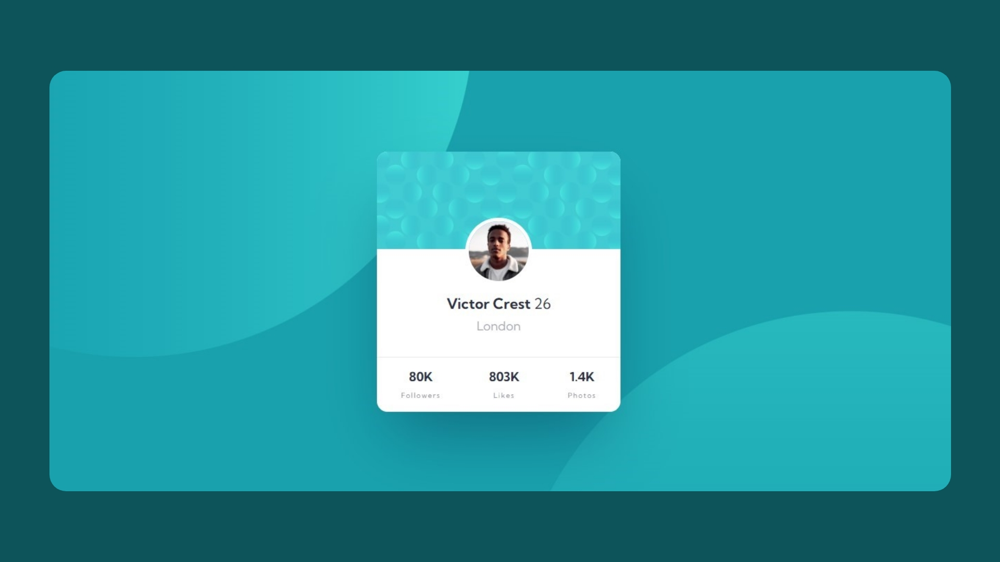

# Frontend Mentor - Profile card component solution

This is my solution to the [Profile card component challenge on Frontend Mentor](https://www.frontendmentor.io/challenges/profile-card-component-cfArpWshJ)

## Table of contents

- [Frontend Mentor - Profile card component solution](#frontend-mentor---profile-card-component-solution)
  - [Table of contents](#table-of-contents)
  - [Overview](#overview)
    - [The challenge](#the-challenge)
    - [Preview](#preview)
  - [My process](#my-process)
    - [Built with](#built-with)
    - [What I learned](#what-i-learned)
    - [Continued development](#continued-development)
  - [Author](#author)
  - [Acknowledgments](#acknowledgments)

## Overview

### The challenge

- Build out the project to the designs provided

### Preview

## My process
I completed the challenge using scss which was fun but i had a bit of trouble with css positioning but it really turned out great.

### Built with

- Semantic HTML5 markup
- CSS custom properties
- CSS Grid
- [SASS/SCSS](https://sass-lang.com/)

### What I learned

- SASS Partials
- SASS Functions

### Continued development

As mentioned I had a bit of trouble with CSS position so I would see myself having refined it future projects as well as my mastery of CSS/SCSS.

## Author

- Website - [raeesbrene](https://www.your-site.com)
- Frontend Mentor - [@rbrene](https://www.frontendmentor.io/profile/rbrene)

**Note: Delete this note and add/remove/edit lines above based on what links you'd like to share.**

## Acknowledgments

A big thank you to the FrontEndMentor platform in improve my skills.
